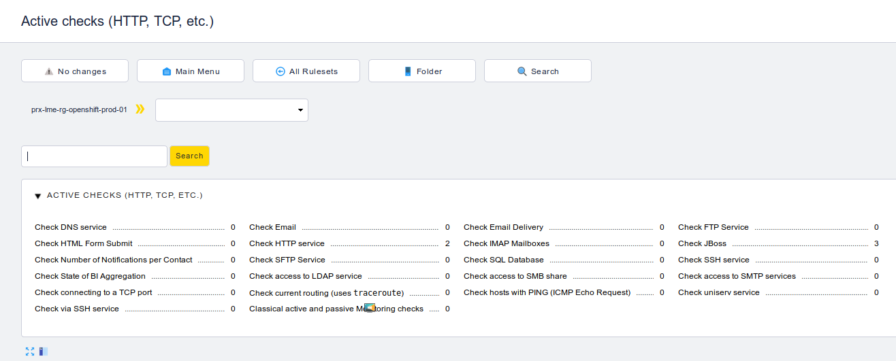
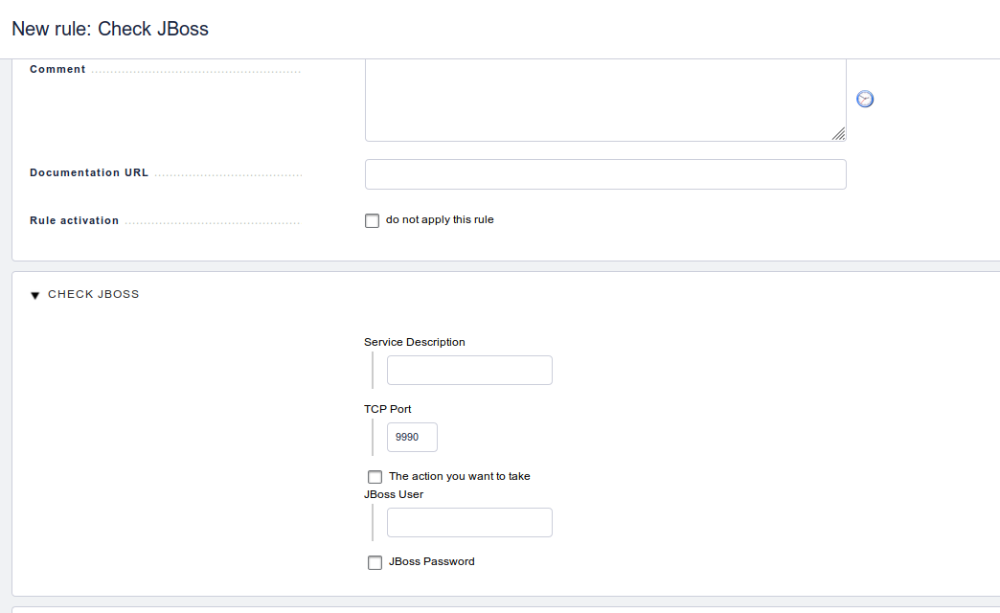

check_jboss7
============
check_mk active check for JBoss7 using an existing nagios plugin.

Description
===========
check_mk may fetch services' status either with the use of an agent, or with [active cheks](https://checkmk.com/cms_wato_services.html#active_checks). This repo offers a comprehensive set of instructions, along with a couple of python files needed, on how to integrate an active check_mk JBoss 7 nagios check inside a check_mk installation.

Luckily enough, there is an excellent nagios plugin to perform the actual check, which may be found in this [repo](https://github.com/aparnachaudhary/nagios-plugin-jbossas7.git), so the effort focuses on the integration part with check_mk engine.

Requirements
============
- check_mk (tested with versions 1.5.0p16 & 1.5.0p22),
- JBoss7 nagios plugin available in this [repo](https://github.com/aparnachaudhary/nagios-plugin-jbossas7.git)

Installation
============
- Place the nagios plugin in ~/local/lib/nagios/plugins and make the .py file executable,
- Place check_jboss in ~/local/share/check_mk/checks/check_jboss,
- Place check_parameters_check_jboss.py ~/local/share/check_mk/web/plugins/wato.

Use
===
Explore to WATO * CONFIGURATION -> Host & Service Parameters -> Active checks. 
 

Click on "Check JBoss" and create a new rule in the folder of your preference.
 

Provide the "Service Description" field and at least the username and the password of an existing JBoss user, who has access to the management endpoint (by default is accessible at https://site.example.com:9990/console) and click Save. The action field by default takes the value "server_status" that relates to the nagios plugin and provides a check for the service status. Similarly, if you want to monitor the heap size you need to choose "heap_usage" etc.
